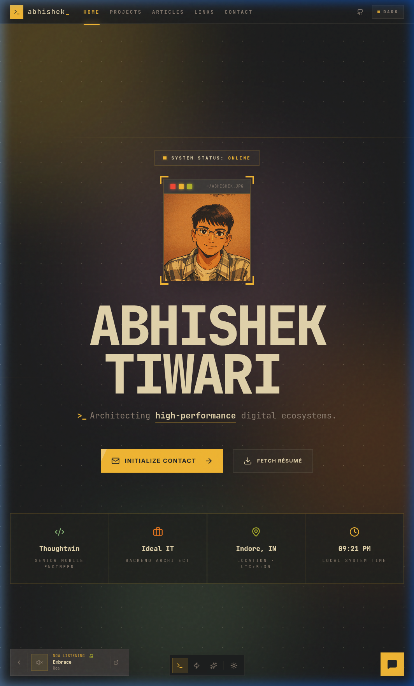
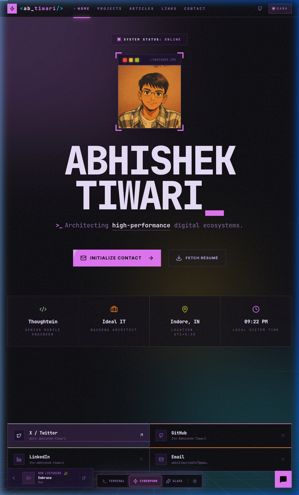
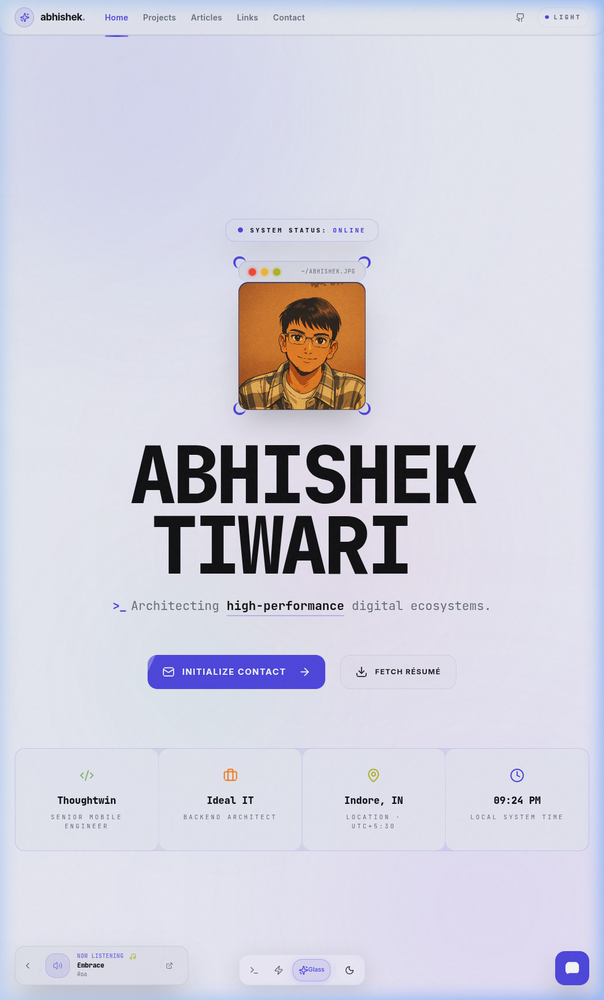

# Abhishek Tiwari - Full-Stack Architect Portfolio

A premium, high-performance portfolio website featuring a unique **Multi-Style Theme Engine**. Users can seamlessly toggle between three distinct aesthetic experiences, each with its own layout, typography, and interactive elements.

## 🚀 Live Preview
[abhishektiwari.in](https://abhishektiwari00.netlify.app/)

---

## 🎨 Aesthetic Themes

The portfolio features three handcrafted themes that redefine the user experience with immersive design tokens and custom animations.

### 1. 📺 Terminal (Vibrant Gruvbox)
A retro-inspired developer aesthetic using the iconic Gruvbox color palette.
- **Typography:** JetBrains Mono
- **Elements:** CLI-style window frames, dot-grid backgrounds, and high-contrast system accents.



### 2. ⚡ Cyberpunk (Neon Retrowave)
A high-energy, immersive HUD experience with neon glows and glitch effects.
- **Typography:** Mono & Slashed fonts
- **Elements:** Scanline overlays, perspective grids, and reactive neon borders.



### 3. 🧊 Glassmorphism (Modern Minimal)
A clean, premium design focused on depth and visibility.
- **Typography:** Plus Jakarta Sans
- **Elements:** Frosted glass `backdrop-blur` cards, pastel gradients, and soft floating orbs.



---

## 🛠️ Technical Stack

- **Frontend:** React.js, TailwindCSS, Framer Motion
- **State Management:** Custom `StyleContext` for multi-theme orchestration
- **Animations:** Dynamic sequence animations & high-performance transitions
- **Icons:** Lucide React

---

## 🏗️ Architecture: Theme Engine

The project implements a sophisticated **Theme-Aware Component Architecture**. Instead of simple CSS variables, components are designed to react to the `designStyle` state:

```javascript
const { designStyle } = useStyle();
const isCyberpunk = designStyle === 'cyberpunk';

return (
    <Section>
        {isCyberpunk ? <CyberpunkHero /> : <DefaultHero />}
    </Section>
);
```

---

## ⚙️ Getting Started

1. **Clone the repository**:
   ```bash
   git clone https://github.com/Itz-Abhishek-Tiwari/Abhishek-Portfolio.git
   ```
2. **Install dependencies**:
   ```bash
   npm install
   ```
3. **Run in development**:
   ```bash
   npm run dev
   ```

---

© 2025 Abhishek Tiwari. All rights reserved.
